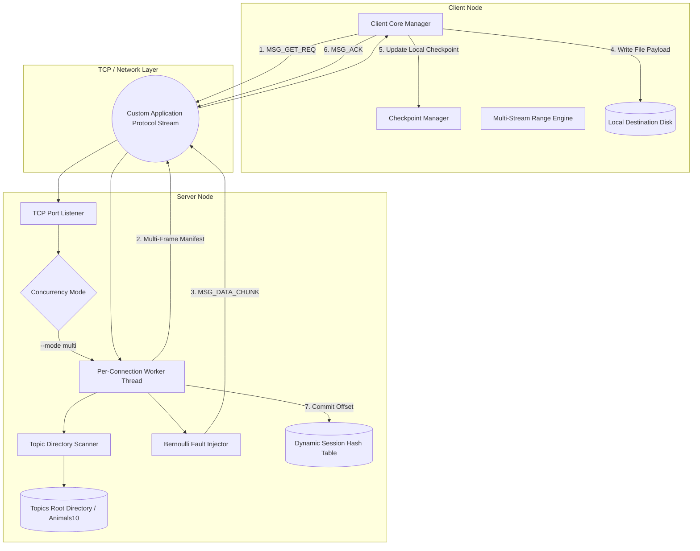
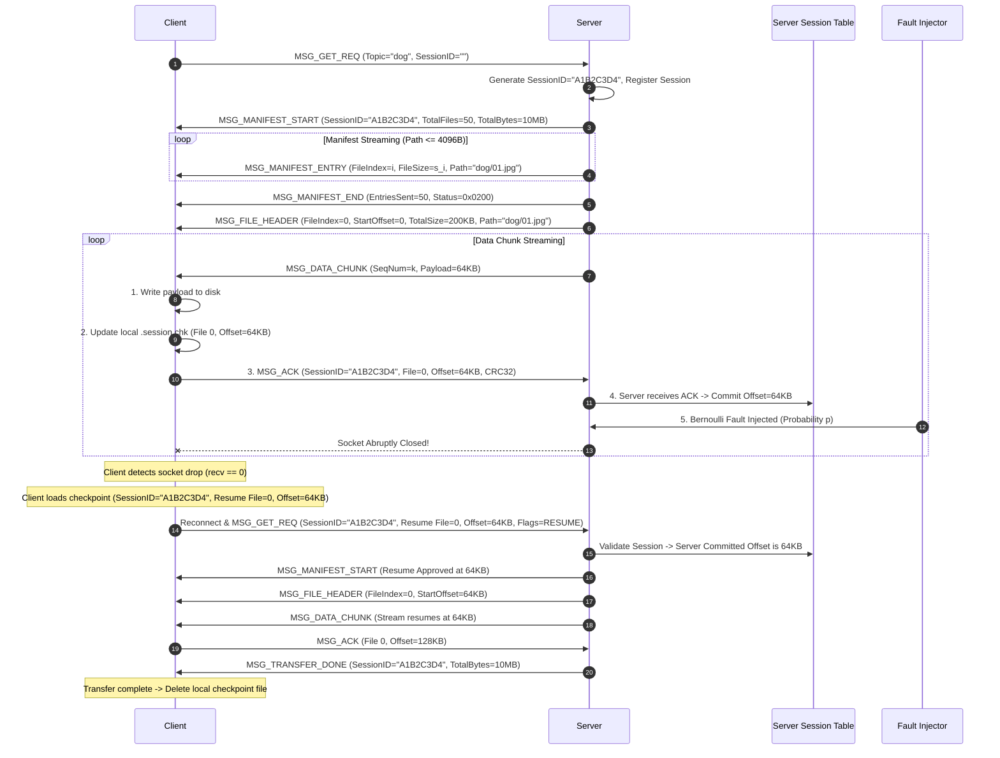

# Fault-Tolerant Topic-Based File Distribution Service

> A high-performance POSIX C99 topic file distribution architecture over TCP featuring single-threaded and multi-threaded server execution models, probabilistic fault injection, un-sessioned restart recovery, checkpoint-based session resume with explicit acknowledgement commitments, and multi-stream non-blocking range streaming.

> **Engineering Status:** Phase 0 — Core Protocol & Infrastructure Complete (v1.2.0 Approved Specification Baseline)

---

## Overview

The **Fault-Tolerant Topic-Based File Distribution Service** is a reliable network application developed in C99 using POSIX sockets and pthreads for the IT305 Socket Programming course project. The system distributes topic-organized dataset directories (specifically the **Animals10** dataset) over TCP networks to concurrent client nodes under both ideal and lossy network conditions.

The project is structured into two primary parts:
1. **Part I — Topic-Based File Distribution:** Evaluates baseline TCP transfer efficiency across sequential (single-threaded) and concurrent (multi-threaded) server architectures. Clients request dataset subfolders (e.g. `dog`, `cat`, `butterfly`) via `GET <topic>`, and the server streams the complete directory tree using a custom application-layer framing protocol.
2. **Part II — Fault-Tolerant File Transfer:** Introduces probabilistic network connection drops ($p \in [0.0, 1.0]$) during active streaming to evaluate recovery mechanisms across three variants:
   - **Case 1 (Full Restart):** Connection failures interrupt active transfers; client reconnects and restarts streaming from File 0, Byte Offset 0, causing measurable **redundant retransmissions**.
   - **Case 2 (Session Management & Checkpoint Commitment):** Implements client disk checkpointing (`.session_<topic>.chk`) and server session tracking. Data is committed strictly after client disk write and explicit `MSG_ACK` receipt. Reconnection resumes from the last committed ACK offset, enforcing **checkpoint-based minimized redundancy**.
   - **Case 2 Enhanced (Multi-Stream Non-Blocking Range Streaming):** Multiplexes $K$ parallel TCP connection streams using non-blocking I/O (`epoll`/`select`), distributing disjoint byte range requests to isolate connection losses per range and evaluate whether parallel streams improve throughput over lossy links.

All system variations will undergo empirical performance benchmarks measuring aggregate throughput, wall-clock completion time, useful payload bytes, redundant retransmitted bytes, and protocol overhead.

---

## Project Objectives

- **Robust TCP Application Protocol:** Eliminate byte-stream framing ambiguity using a 12-byte fixed header, explicit 32-bit sequence numbers, network byte order serialization (`htonl`/`ntohl`), and multi-frame manifest sequences.
- **Dynamic Topic Directory Discovery:** Dynamically scan and stream dataset directory structures under `<topics_root_dir>/<topic>`, enforcing relative path safety limits ($MAX\_PATH\_LEN = 4096$).
- **Dual Server Concurrency Architecture:** Implement both sequential single-threaded and worker-thread per client (`pthread_create`) multi-threaded execution models.
- **Probabilistic Fault Injection Engine:** Intercept active chunk streaming on the server immediately before socket writes to probabilistically terminate worker socket descriptors based on failure probability $p$.
- **Checkpoint Commitment State Machine:** Maintain session state on server and client, ensuring payload bytes before the last committed ACK offset are never retransmitted upon reconnect.
- **Multi-Stream Non-Blocking I/O:** Implement parallel range chunking over $K$ concurrent TCP streams using reactor multiplexing (`epoll`/`select`).
- **Comprehensive Byte Accounting:** Enforce strict conservation accounting: $B_{wire} = B_{useful} + B_{redundant} + B_{overhead}$.
- **Zero-Hardcoding Policy:** Enforce complete runtime configuration via mandatory command-line arguments without hardcoded IP addresses, ports, or directory paths.

---

## System Architecture

The service adopts a decoupled, modular architecture. Shared framing, socket I/O, checksum, and utility modules reside in `src/common/` and link cleanly into standalone server and client executables across submission directories.

### Architecture Diagram



### Component Modules Responsibility Matrix

| Component Module | File Location | Status | Primary Responsibility |
| :--- | :--- | :--- | :--- |
| **Protocol Library** | [src/common/protocol.h](src/common/protocol.h), [.c](src/common/protocol.c) | **Complete** | 12-byte header serialization, scalar field packing, frame validation, and `read_n()` / `write_n()` TCP I/O helpers. |
| **Checksum Module** | [src/common/checksum.h](src/common/checksum.h), [.c](src/common/checksum.c) | **Complete** | Lock-free, thread-safe IEEE 802.3 CRC32 calculation (`0xEDB88320`) for local checkpoint file integrity. |
| **Utilities Module** | [src/common/utils.h](src/common/utils.h), [.c](src/common/utils.c) | **Complete** | Formatted level logging, `CLOCK_MONOTONIC` timing, strict unsigned decimal parsing, and untrusted path traversal validation (`is_safe_relative_path`). |
| **Topic Manager** | `src/server/topic_mgr.h`, `.c` | *Planned (Phase 1)* | Directory traversal, file manifest construction, and relative path safety verification. |
| **Server Core** | `src/server/server_core.h`, `.c` | *Planned (Phase 1/2)* | TCP socket listening, connection dispatcher, and pthread worker management. |
| **Fault Injector** | `src/server/fault_inject.h`, `.c` | *Planned (Phase 3)* | Thread-safe per-chunk Bernoulli fault generator (`rand_r(&seed)`). |
| **Session Manager** | `src/server/session_mgr.h`, `.c` | *Planned (Phase 4)* | Dynamic thread-safe hash table storing active/suspended client sessions and committed ACK offsets. |
| **Checkpoint Engine**| `src/client/checkpoint.h`, `.c` | *Planned (Phase 4)* | Local checkpoint persistence (`.session_<topic>.chk`) and resume state parsing. |
| **Multi-Stream Engine**| `src/client/range_stream.h`, `.c` | *Planned (Phase 5)* | $K$ parallel TCP connection manager, non-blocking `epoll`/`select` reactor, and disjoint range chunk work-queue. |
| **Experiment Harness**| `scripts/run_experiments.sh`, `plot_results.py` | *Planned (Phase 6)* | Multi-client benchmark execution, CSV data collection, and automated graph plotting. |

---

## Project Workflow

The following sequence illustrates a complete topic distribution workflow under Case 2 session checkpointing:



---

## Fault-Tolerant Transfer Architecture

### Case 1 — Full Restart
- **Behavior:** Connection failures immediately interrupt active transfers. The client detects disconnection, re-establishes a TCP socket, and sends a fresh request.
- **Recovery:** Transfer restarts completely from File 0, Byte Offset 0.
- **Consequence:** All previously transferred topic payload bytes are retransmitted, generating substantial **redundant retransmissions** ($B_{redundant}$) proportional to dataset size and failure probability $p$.

### Case 2 — Session & Checkpoint Recovery (Checkpoint-Based Minimized Redundancy)
- **Commitment Semantics:** A byte offset is considered *successfully transferred and committed* ONLY after:
  1. Client receives the byte payload frame.
  2. Client writes the payload to disk.
  3. Client updates its local checkpoint file (`.session_<topic>.chk`).
  4. Client transmits a `MSG_ACK` frame `(Session_ID, File_Index, Acked_Byte_Offset)`.
  5. Server receives and processes that `MSG_ACK`.
- **Pre-ACK Failure Handling:** If a failure occurs before the server commits the `MSG_ACK`, data sent after the last committed checkpoint offset $O_{last\_ack}$ must be retransmitted. Those retransmitted file payload bytes are counted as $B_{redundant}$.
- **Guarantee:** Case 2 guarantees that payload bytes BEFORE the last committed checkpoint offset are **NEVER retransmitted**.

### Case 2 Enhanced — Multi-Stream Non-Blocking Range Streaming
- **Parallel Architecture:** Client spawns $K$ concurrent TCP socket streams (configurable via `--parallel-streams K`, default $K=4$) managed by a non-blocking `epoll`/`select` reactor.
- **Disjoint Work-Queue:** Topic files are partitioned into non-overlapping chunk ranges $[start\_offset, end\_offset)$. Streams dynamically pull chunk ranges from a synchronized work-queue, eliminating range overlap.
- **Stream Failure Isolation:** If stream $i$ suffers a connection drop, only its active un-ACKed range chunk is returned to the work-queue. Remaining streams continue downloading uninterrupted.
- **Range Checkpointing:** Checkpoint files persist the highest contiguous completed byte offset across streams to ensure consistent session recovery.

#### Alternatives Considered

| Approach | Architecture Overview | Tradeoffs & Technical Selection |
| :--- | :--- | :--- |
| **1. Single Blocking TCP Stream** | Sequential blocking `recv()`/`send()` loop. | Simple, but vulnerable to TCP head-of-line blocking and link underutilization over lossy links. |
| **2. Single Non-Blocking TCP Stream** | Event loop (`epoll`) over 1 socket. | Eliminates thread overhead, but single TCP congestion window stalls on packet loss. |
| **3. Pipelined Requests over 1 Socket** | Multiple range requests queued on 1 socket. | Reduces round-trip latency, but a single lost TCP segment stalls the entire pipe. |
| **4. Multi-Stream TCP Parallel Ranges** | $K$ parallel TCP sockets with non-blocking I/O. | **Chosen Architecture:** Bypasses single-connection congestion bottlenecks and isolates drops per stream range. |

*Note: Performance gains are evaluated empirically through comparative measurement; no fixed percentage throughput improvement is assumed.*

---

## Protocol Specification

The wire protocol framing standard defined in [docs/PROTOCOL.md](docs/PROTOCOL.md) strictly eliminates TCP byte-stream ambiguity.

### Fixed Header Layout (12 Bytes)

```text
 0                   1                   2                   3
 0 1 2 3 4 5 6 7 8 9 0 1 2 3 4 5 6 7 8 9 0 1 2 3 4 5 6 7 8 9 0 1
+-+-+-+-+-+-+-+-+-+-+-+-+-+-+-+-+-+-+-+-+-+-+-+-+-+-+-+-+-+-+-+-+
|          Magic Bytes          |  Msg Type (1B)|   Flags (1B)  |
|         0x49 0x54 ('IT')      |               |               |
+-+-+-+-+-+-+-+-+-+-+-+-+-+-+-+-+-+-+-+-+-+-+-+-+-+-+-+-+-+-+-+-+
|                        Payload Length (4B)                    |
+-+-+-+-+-+-+-+-+-+-+-+-+-+-+-+-+-+-+-+-+-+-+-+-+-+-+-+-+-+-+-+-+
|                     Sequence Number (4B)                      |
+-+-+-+-+-+-+-+-+-+-+-+-+-+-+-+-+-+-+-+-+-+-+-+-+-+-+-+-+-+-+-+-+
```

- **Magic Bytes (2B):** `0x4954` ('I', 'T'). Packets with invalid magic are rejected immediately.
- **Msg Type (1B):** Message identifier (`msg_type_t`).
- **Flags (1B):** Bit flags (`0x01` = FLAG_RESUME, `0x02` = FLAG_EOF_FILE, `0x04` = FLAG_FINAL_DONE, `0x08` = FLAG_ERR).
- **Payload Length (4B):** 32-bit unsigned integer ($L \le 65536$).
- **Sequence Number (4B):** 32-bit unsigned packet sequence number (`seq_num`).
- **File Offsets (64-bit):** All 64-bit file byte offsets (`uint64_t`) are explicitly serialized inside frame payloads.
- **Path Length Limit:** Relative file path strings MUST NOT exceed $MAX\_PATH\_LEN = 4096$ bytes.

### Protocol Message Types

| Type Code | Symbol | Direction | Purpose |
| :---: | :--- | :---: | :--- |
| **0x01** | `MSG_GET_REQ` | Client $\rightarrow$ Server | Request topic transfer (new or resume). |
| **0x02** | `MSG_MANIFEST_START` | Server $\rightarrow$ Client | Begin manifest streaming (session ID, totals). |
| **0x03** | `MSG_FILE_HEADER` | Server $\rightarrow$ Client | Signal start of specific file in topic. |
| **0x04** | `MSG_DATA_CHUNK` | Server $\rightarrow$ Client | Stream raw file payload chunk (up to 64 KB). |
| **0x05** | `MSG_ACK` | Client $\rightarrow$ Server | Explicit checkpoint commitment ACK. |
| **0x06** | `MSG_TRANSFER_DONE` | Server $\rightarrow$ Client | Signal topic transfer completion. |
| **0x07** | `MSG_ERROR` | Server $\rightarrow$ Client | Report protocol error state. |
| **0x08** | `MSG_RANGE_REQ` | Client $\rightarrow$ Server | Enhanced mode parallel stream range request. |
| **0x09** | `MSG_MANIFEST_ENTRY` | Server $\rightarrow$ Client | Stream single file entry in manifest. |
| **0x0A** | `MSG_MANIFEST_END` | Server $\rightarrow$ Client | Signal completion of manifest streaming. |

### Protocol Error Codes

| Code | Symbol | Meaning |
| :---: | :--- | :--- |
| **0x0400** | `ERR_PATH_TOO_LONG` | Relative path string exceeds $MAX\_PATH\_LEN = 4096$ bytes. |
| **0x0401** | `ERR_BAD_MAGIC` | Header magic bytes do not match `0x4954`. |
| **0x0402** | `ERR_BAD_PAYLOAD_LEN` | Payload length exceeds $MAX\_PAYLOAD\_LEN = 65536$ bytes. |
| **0x0403** | `ERR_BAD_MSG_TYPE` | Message type identifier unrecognized. |
| **0x0404** | `ERR_TOPIC_NOT_FOUND` | Requested topic directory does not exist or is unreadable. |
| **0x0405** | `ERR_BAD_FLAGS` | Header contains undefined/reserved flag bits. |
| **0x0409** | `ERR_INVALID_SESSION` | Session ID invalid or expired on server. |
| **0x0500** | `ERR_INTERNAL_SERVER` | Internal server filesystem or I/O error. |
| **0x0503** | `ERR_SERVER_FULL` | Server dynamic session capacity reached. |

---

## Repository Structure

### Current Repository Structure (Phase 0 Complete)

```text
IT305-Socket-Programming/
├── AGENTS.md                   # Agent & developer operational conventions
├── Makefile                    # Root build script delegating to sub-Makefiles
├── README.md                   # Project documentation & overview
├── docs/                       # Approved Engineering Specifications
│   ├── ARCHITECTURE.md         # System design, data structures & fault model
│   ├── EXPERIMENT_PLAN.md      # Empirical metrics, variables & CSV schemas
│   ├── IMPLEMENTATION_PLAN.md  # 8-phase implementation roadmap
│   ├── INTEGRATION_PLAN.md     # 6-workstream ownership & Git strategy
│   ├── PROJECT_SPEC.md         # Requirements, CLI signatures & submission layout
│   ├── PROTOCOL.md             # Wire protocol & binary header specification
│   └── TEST_PLAN.md            # Comprehensive test matrix & acceptance criteria
├── src/                        # Core Shared Source Modules
│   └── common/
│       ├── checksum.c          # Lock-free IEEE 802.3 CRC32 implementation
│       ├── checksum.h          # CRC32 header interface
│       ├── protocol.c          # Header packing, byte order & read_n/write_n
│       ├── protocol.h          # Framing constants, header_t, msg_type_t
│       ├── utils.c             # Formatted logging, CLOCK_MONOTONIC & path safety
│       └── utils.h             # Logging macros, is_safe_relative_path prototype
└── tests/                      # Core Unit Test Suite
    ├── Makefile                # Test harness build script (-std=c99 -Werror)
    └── test_phase0.c           # 17 comprehensive unit tests
```

### Planned Submission Directory Structure (Phases 1–7)

```text
IT305-Socket-Programming/
├── Part1/                      # Part I Standalone Build (server, client)
│   ├── Makefile                # Target: server, client
│   ├── server.c
│   └── client.c
├── Part2_Case1/                # Part II Case 1 Standalone Build (server, client)
│   ├── Makefile                # Target: server, client
│   ├── server.c
│   └── client.c
├── Part2_Case2/                # Part II Case 2 Standalone Build (server, client)
│   ├── Makefile                # Target: server, client
│   ├── server.c
│   └── client.c
├── Part2_Case2_Enhanced/       # Case 2 Enhanced Standalone Build (server, client)
│   ├── Makefile                # Target: server, client
│   ├── server.c
│   └── client.c
├── Results/                    # Benchmark CSV logs & generated PNG graphs
│   ├── raw_data/               # Benchmark CSV logs
│   └── plots/                  # Generated performance PNG graphs
└── scripts/                    # Automation & Plotting Scripts
    ├── run_experiments.sh      # Automated multi-client test harness
    └── plot_results.py         # Matplotlib performance graph generator
```

---

## Implementation Roadmap

The project follows an 8-phase implementation roadmap defined in [docs/IMPLEMENTATION_PLAN.md](docs/IMPLEMENTATION_PLAN.md):

| Phase | Description | Key Deliverables / Focus | Status |
| :---: | :--- | :--- | :---: |
| **Phase 0** | **Core Infrastructure & Protocol** | 12-byte header packing, `read_n`/`write_n`, CRC32, `is_safe_relative_path`, 17 unit tests. | **COMPLETE** |
| **Phase 1** | **Part I Single-Threaded Server & Client** | Sequential topic discovery, multi-frame manifest, synchronous single-client file streaming. | *PLANNED* |
| **Phase 2** | **Part I Multi-Threaded Server** | Pthread worker per client connection (`pthread_create`), concurrent transfer validation. | *PLANNED* |
| **Phase 3** | **Part II Case 1 Fault Injection** | Per-chunk Bernoulli fault generator (`--seed`), un-sessioned full restart, retransmission logging. | *PLANNED* |
| **Phase 4** | **Part II Case 2 Checkpoint Commitment** | Dynamic server session hash table, local disk checkpointing (`.session.chk`), explicit ACK commitment loop. | *PLANNED* |
| **Phase 5** | **Case 2 Enhanced Parallel Streaming** | $K$ parallel TCP streams, non-blocking `epoll`/`select` reactor, disjoint range work-queue. | *PLANNED* |
| **Phase 6** | **Automated Experimentation** | Multi-computer test harness scripts, CSV logging schema, Matplotlib performance graph generation. | *PLANNED* |
| **Phase 7** | **Final Submission & Report** | Clean submission folder assembly (`Part1/`..`Part2_Case2_Enhanced/`), final report PDF assembly. | *PLANNED* |

---

## Build Instructions

### Prerequisites
- GCC Compiler with C99 and POSIX.1-2008 support (`-std=c99 -D_POSIX_C_SOURCE=200809L`)
- POSIX Threads (`-pthread`)
- GNU Make

### Building & Running Phase 0 Unit Tests
To build and execute the currently implemented Phase 0 test suite:

```bash
# Execute unit tests from root Makefile
make test

# Or build and run directly inside tests/
cd tests
make run
```

### Compiler Flags Enforced
All build scripts strictly enforce zero warnings under GCC:
```bash
gcc -std=c99 -D_POSIX_C_SOURCE=200809L -Wall -Wextra -Werror -pedantic -g -pthread
```

---

## Usage

### Current Implemented Usage (Phase 0)
Execute the 17-test core protocol and infrastructure verification suite:
```bash
make test
```

### Planned CLI Signatures (Phases 1–5)

#### Part I Server Executable
```bash
./server <port> <topics_root_dir> [--mode single|multi]
```
- `<port>`: TCP port to bind (1024–65535).
- `<topics_root_dir>`: Path to root topic dataset directory (e.g. `./dataset/Animals10`).
- `[--mode single|multi]`: Optional mode selector. Defaults to `multi`.

#### Part II Server Executable (Case 1, Case 2, Case 2 Enhanced)
```bash
./server <port> <topics_root_dir> <failure_probability> [--seed <uint32>]
```
- `<failure_probability>`: Floating-point value $p \in [0.0, 1.0]$.
- `[--seed <uint32>]`: Optional seed for deterministic fault generation during test automation.

#### Client Executable (All Parts & Cases)
```bash
./client <server_ip> <server_port> <topic> <output_dir> [--max-retries <N>] [--parallel-streams <K>]
```
- `<server_ip>`: IPv4 address of target server.
- `<server_port>`: TCP port of target server.
- `<topic>`: Requested topic dataset subfolder name (e.g. `dog`, `cat`).
- `<output_dir>`: Local destination directory.
- `[--max-retries <N>]`: Max reconnect attempts before aborting (default: 10).
- `[--parallel-streams <K>]`: Number of parallel TCP streams for Case 2 Enhanced (default: 4).

---

## Testing Strategy

The repository follows a rigorous test plan documented in [docs/TEST_PLAN.md](docs/TEST_PLAN.md).

### Implemented Phase 0 Verification
The current test suite (`tests/test_phase0.c`) executes 17 automated unit tests covering:
1. **Header Serialization:** Packs/unpacks `header_t` into 12 bytes network byte order.
2. **Network Byte Order:** Verifies Big-Endian scalar packing (`serialize_uint16`, `serialize_uint32`).
3. **Header Length:** Asserts `HEADER_LEN == 12U`.
4. **Sequence Numbers:** Verifies 32-bit sequence number edge values (`0xFFFFFFFEU`).
5. **uint64 Serialization:** Verifies 64-bit byte-shift offset packing (`0x123456789ABCDEF0ULL`).
6. **Fragmented `read_n()`:** Writer thread transmits payload in 3 distinct pieces with 5ms micro-delays; reader blocks and accumulates data across 3 separate `recv()` calls.
7. **Backpressure `write_n()`:** Small socket buffers (4 KiB `SO_SNDBUF`/`SO_RCVBUF`) paired with a 128 KiB payload force `send()` to execute dozens of partial write iterations as reader consumes data in 2 KiB chunks.
8. **Invalid Magic:** Rejects headers with bad magic (`0xDEAD` $\rightarrow$ `ERR_BAD_MAGIC`).
9. **Invalid Payload Length:** Rejects payload lengths $> 65536$ (`ERR_BAD_PAYLOAD_LEN`).
10. **Payload Boundary:** Accepts length 65536, rejects 65537.
11. **Invalid Message Type:** Rejects unrecognized message types (`0xFF` $\rightarrow$ `ERR_BAD_MSG_TYPE`).
12. **Reserved Flags:** Rejects reserved flag bits (`0x80` $\rightarrow$ `ERR_BAD_FLAGS`).
13. **CRC32 Test Vector:** Asserts `crc32_calculate("123456789", 9) == 0xCBF43926U`.
14. **Lock-Free Multithreaded CRC32:** Spawns 8 pthread workers executing 5,000 CRC calls each simultaneously to verify zero data races.
15. **Path Traversal Protection:** Asserts `is_safe_relative_path()` rejects `..`, `../file`, `a/../b`, `./file`, `/abs`, `a//b`, while accepting `file.txt`, `subdir/file.txt`, `abc..def`.
16. **Strict Unsigned Int Parsing:** Verifies `parse_uint16`/`parse_uint32` accept `"0"`, `"65535"`, `"4294967295"` while strictly rejecting `""`, `NULL`, `"-1"`, `"+1"`, `" 1"`, `"1 "`, `"\t1"`, `"12abc"`.
17. **Path Length Boundary:** Verifies 4096-byte paths are accepted and 4097-byte paths are rejected.

---

## Performance Evaluation

The experimentation framework defined in [docs/EXPERIMENT_PLAN.md](docs/EXPERIMENT_PLAN.md) defines a planned benchmark methodology across 3 physical/virtual Linux nodes (1 Server Node, 2 Client Nodes).

### Benchmark Matrix
- **Concurrent Clients ($N$):** $N \in \{1, 2, 4, 8, 16, 32\}$
- **Failure Probabilities ($p$):** $p \in \{0.00, 0.05, 0.10, 0.20, 0.50\}$
- **Trial Repetitions:** $M = 5$ independent trials per parameter point (reporting mean and 95% confidence intervals).

### Precise Byte Accounting Framework
All planned experimental trials will log network bytes per the strict byte conservation equation:

$$B_{wire} = B_{useful} + B_{redundant} + B_{overhead}$$

- **Useful Bytes ($B_{useful}$):** Net payload file bytes successfully written to disk forming the requested dataset.
- **Redundant Bytes ($B_{redundant}$):** Retransmitted **FILE PAYLOAD bytes ONLY** sent after the last committed checkpoint due to un-ACKed connection failures.
- **Protocol Overhead Bytes ($B_{overhead}$):** Every transmitted application-protocol byte that is NOT file payload data (12-byte headers, `MANIFEST_*` payloads, `MSG_ACK` frames, error/control frames, and headers of retransmitted data chunks).
- **Wire Bytes ($B_{wire}$):** Total bytes sent/received across TCP sockets.

### Effective Throughput Formula
Aggregate system throughput is calculated as:

$$R_{eff} = \frac{8 \times B_{useful}}{10^6 \times T_{comp}} \quad \text{(Mbps)}$$

where $T_{comp}$ is wall-clock completion time recorded via `clock_gettime(CLOCK_MONOTONIC)`.

---

## Engineering Design Documents

Detailed technical specifications and architectural documentation are available in `docs/`:

| Document | Description |
| :--- | :--- |
| [Project Specification](docs/PROJECT_SPEC.md) | Functional/non-functional requirements, CLI interfaces, submission directory rules, and design decision resolutions. |
| [System Architecture](docs/ARCHITECTURE.md) | Concurrency models, session table schemas, explicit ACK commitment state machine, and fault injection design. |
| [Protocol Specification](docs/PROTOCOL.md) | 12-byte binary header layout, network byte order rules, message types, multi-frame manifest schemas, and error codes. |
| [Implementation Plan](docs/IMPLEMENTATION_PLAN.md) | 8-phase implementation roadmap with explicit acceptance criteria per phase. |
| [Test Plan](docs/TEST_PLAN.md) | 19-test suite matrix, edge case fault injection procedures, and leak audit standards. |
| [Experiment Plan](docs/EXPERIMENT_PLAN.md) | Benchmark methodology, testbed topology, byte conservation formulas, and CSV logging schema. |
| [Integration Plan](docs/INTEGRATION_PLAN.md) | 6-workstream team ownership matrix, shared module build strategy, and Git merge workflows. |
| [Agent Guidance](AGENTS.md) | Operational conventions, zero-hardcoding policy, resource management rules, and protocol integrity guidelines. |

---

## Development Workflow

- **Intended Branching Strategy:**
  - `main`: Intended stable release branch.
  - `design-foundation`: Approved specification baseline (v1.2.0).
  - `feature/ws1-protocol-core`: Active implementation branch for Phase 0 infrastructure.
- **Planned Merge Strategy:** Workstream feature branches are planned to be merged sequentially into `main` after automated build and unit test verification.
- **Contract Stability:** Shared header contracts (`src/common/protocol.h`, `checksum.h`, `utils.h`) remain stable across all workstreams.

---

## Engineering Principles

- **Zero Hardcoding Policy:** Network ports, IP addresses, directory paths, and topics are strictly accepted via command-line interface arguments.
- **Strict Input & Path Validation:** All incoming strings, paths, and numbers are validated before processing (`is_safe_relative_path`, `validate_header`, `parse_uint32`).
- **Network Byte Order Standard:** All numeric binary fields are converted to Big-Endian network byte order (`htonl`/`ntohl`) prior to transmission.
- **Robust TCP Stream Handling:** All socket read/write operations use `read_n()` / `write_n()` loops to handle partial TCP transfers, backpressure, and `EINTR`.
- **Explicit Resource Management:** All memory allocations (`malloc`), sockets (`close`), directory handles (`closedir`), and mutexes are cleaned up on all exit paths.
- **Bounded Frame Safety:** Protocol payloads are bounded ($MAX\_PAYLOAD\_LEN = 65536$), and manifest entries enforce relative path limits ($MAX\_PATH\_LEN = 4096$).
- **Deterministic Fault Simulation:** Server fault injection supports a pseudo-random seed parameter (`--seed <uint32>`) for reproducible automated integration testing.
- **Checkpoint Commitment Integrity:** Session resume relies on explicit client `MSG_ACK` receipts before committing state on the server.
- **Empirical Measurement:** System performance gains are evaluated through rigorous multi-trial experimental measurements rather than assumed fixed percentages.

---

## Team Organization

The project is developed by a 6-member group organized into two subgroups:

### Group A — 109
- **Kavya Bhojwani** (202401090)
- **Darshan Talati** (202401046)
- **Aaryan Modi** (202401435)

### Group B — 104
- **Khushi Shah** (202401471)
- **Tanish Sanghvi** (202401465)
- **Siddh Shah** (202401473)

---

## Academic Context

This repository represents the course project for **IT305 Socket Programming**. All implementation code and documentation are the original engineering work of the six team members.

---

## Project Status

- **Current Implementation Milestone:** **Phase 0 — Core Protocol & Infrastructure Complete** (17/17 Unit Tests Passing).
- **Engineering Baseline:** v1.2.0 Approved Specification Baseline.
- **Next Implementation Milestone:** **Phase 1 — Part I Single-Threaded Server & Client**.
