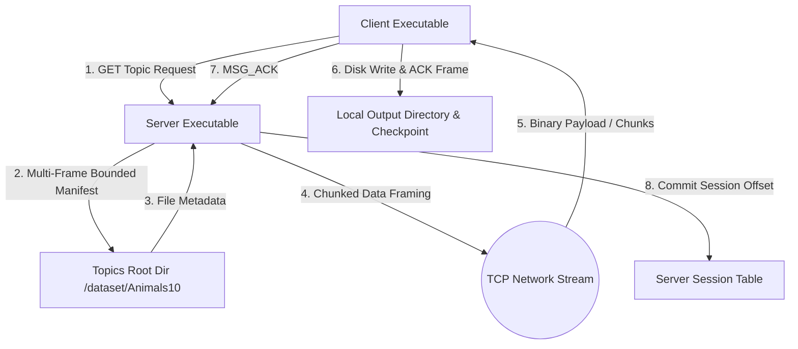
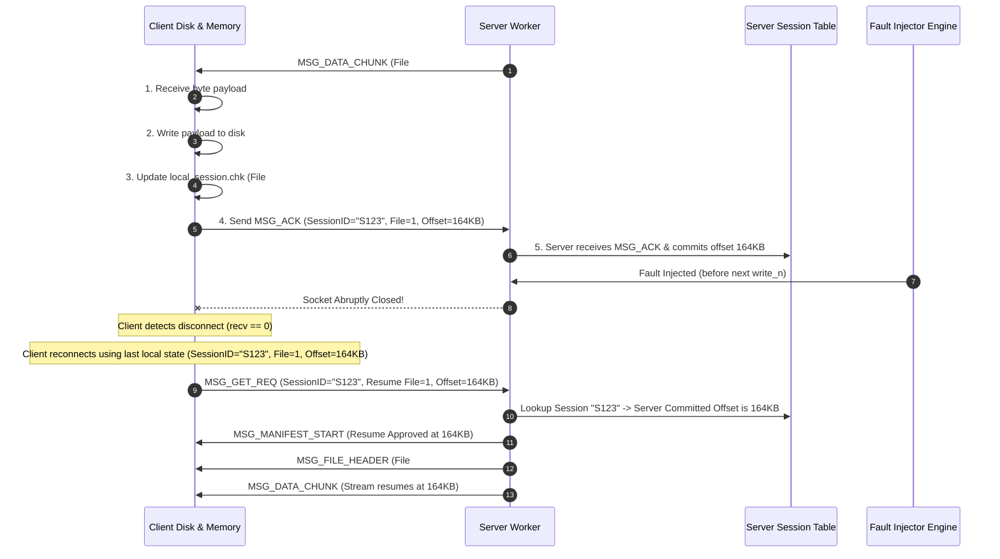

# IT305 Socket Programming Architecture Document
## Fault-Tolerant Topic-Based File Distribution System

**Document Status:** Approved Engineering Architecture (Final Refinement)  
**Version:** 1.2.0  
**Target Architecture:** POSIX / C99 (Linux/UNIX Sockets & Pthreads)

---

## 1. High-Level Architecture Overview

The system consists of a **Topic-Based File Server** and a **File Distribution Client** communicating over standard TCP/IP sockets using a custom length-prefixed application protocol.

---

## 2. Server Concurrency & CLI Architecture

### 2.1 Concurrency Modes & CLI Specification
- **Mandatory Signature:** `./server <port> <topics_root_dir> [failure_probability]`
- **Default Mode:** Multi-Threaded (one pthread per client connection).
- **Mode Flag:** `./server <port> <topics_root_dir> [--mode single|multi]`
  - `single`: Process clients sequentially on the main thread.
  - `multi`: Main listener thread executes `accept()` and spawns detached worker threads (`pthread_create`).

### 2.2 Dynamic Session Table Architecture
The server maintains a thread-safe dynamic session hash table (`session_table_t`), eliminating hardcoded array limits while rejecting client connections with `0x0503 ERR_SERVER_FULL` if configurable system capacity is exceeded.

---

## 3. Case 2 Checkpoint-Based Minimized Redundancy Architecture

### 3.1 Checkpoint Commitment State Machine & Exact Semantics
Case 2 achieves **checkpoint-based minimized redundancy** through an explicit 5-step acknowledgement commitment model:

### 3.2 Commitment Rules & Redundancy Accounting
- **Byte Commitment Definition:** A byte becomes committed ONLY after:
  1. Client receives it,
  2. Writes it to disk,
  3. Updates its local checkpoint file,
  4. Sends a `MSG_ACK` frame, and
  5. The server receives and processes that `MSG_ACK`.
- **Pre-ACK Failure Behavior:** If a connection failure occurs before the server commits the `MSG_ACK`, data sent after the last committed checkpoint may need to be retransmitted.
- **Redundant Bytes ($B_{redundant}$):** Those retransmitted file payload bytes are counted as $B_{redundant}$.
- **Checkpoint Guarantee:** Case 2 guarantees that bytes BEFORE the last committed checkpoint are NEVER retransmitted. In contrast, Case 1 restarts from the beginning (File 0, Byte 0) and can therefore retransmit a much larger amount of data.

---

## 4. Byte Accounting & Conservation Framework

All experiment measurements enforce strict byte conservation:

$$B_{wire} = B_{useful} + B_{redundant} + B_{overhead}$$

- **$B_{useful}$:** Net file payload bytes written to disk forming the final topic dataset.
- **$B_{redundant}$:** Retransmitted **FILE PAYLOAD bytes ONLY** sent after the last committed checkpoint.
- **$B_{overhead}$:** Every transmitted application-protocol byte that is NOT file payload data, including:
  - All 12-byte application headers,
  - Manifest frame payloads (`MSG_MANIFEST_START`, `MSG_MANIFEST_ENTRY`, `MSG_MANIFEST_END`),
  - ACK frames (`MSG_ACK`),
  - Error and control frames (`MSG_ERROR`, `MSG_GET_REQ`, `MSG_RANGE_REQ`, `MSG_TRANSFER_DONE`),
  - Application headers belonging to retransmitted data chunks.

---

## 5. Case 2 Enhanced Architecture: Multi-Stream Parallel TCP

### 5.1 Detailed Design Mechanics
1. **Configurable Parallel Streams ($K$):** Client establishes $K$ concurrent TCP socket connections (default $K=4$, configurable via `--parallel-streams K`).
2. **Chunk Range Queue & Overlap Prevention:** Server manifest is partitioned into a thread-safe work-queue of disjoint range chunks $[start\_offset, end\_offset)$. Worker streams pull range chunks dynamically; overlap is strictly prevented by atomic range reservation.
3. **Completed Range Tracking:** Client maintains an in-memory range map per file. Ranges are marked completed upon disk write and ACK commit.
4. **Stream Failure Recovery:** If stream $i$ suffers a socket disconnect, its active un-ACKed range chunk is returned to the work-queue for re-assignment to another active stream.
5. **Session Checkpoint Integration:** The client checkpoint file records the highest contiguous completed byte offset across streams to ensure consistent session resume.
6. **Topic Completion Detection:** Transfer completes when all file ranges in the manifest map are marked 100% completed and committed.

### 5.2 Alternatives Considered

| Approach | Architecture Description | Tradeoffs & Evaluation |
| :--- | :--- | :--- |
| **1. Single Blocking TCP Stream** | Sequential read/write loop on blocking socket. | Simple implementation; vulnerable to TCP head-of-line blocking and link underutilization over lossy links. |
| **2. Single Non-Blocking TCP Stream** | Reactor pattern using `epoll`/`select` on one socket. | Eliminates thread-per-client overhead, but single TCP connection window still stalls on packet loss. |
| **3. Pipelined Requests over Single Socket** | Multiple GET/Range requests queued over 1 socket. | Reduces round-trip latency, but a single lost segment stalls the entire pipeline. |
| **4. Multi-Stream TCP Parallel Ranges (Chosen)** | $K$ parallel TCP sockets requesting disjoint byte ranges using non-blocking I/O. | **Chosen Architecture:** Bypasses single-connection TCP congestion bottlenecks and isolates connection drops to individual stream ranges. |

*Note:* Enhanced performance is evaluated empirically through experimental measurement; no fixed percentage throughput gain is assumed.

---

## 6. Multi-Frame Bounded Manifest Architecture

To prevent framing buffer overflow:
- **Maximum Path Length:** Relative file paths must not exceed $MAX\_PATH\_LEN = 4096$ bytes.
- **Frame Size Guarantee:** Each `MSG_MANIFEST_ENTRY` frame (12B header + 4B file index + 8B file size + 2B path length + $N$ bytes path) fits well within $MAX\_PAYLOAD\_LEN = 65536$ bytes.
- **Path Length Rejection:** If a file relative path exceeds 4096 bytes, the server aborts manifest creation and returns `MSG_ERROR` (code `0x0400 ERR_PATH_TOO_LONG`).
