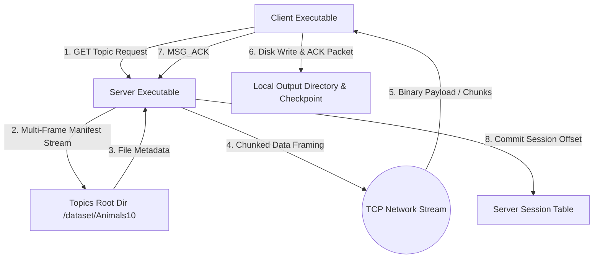
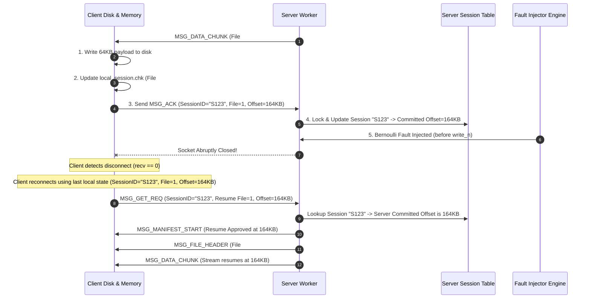
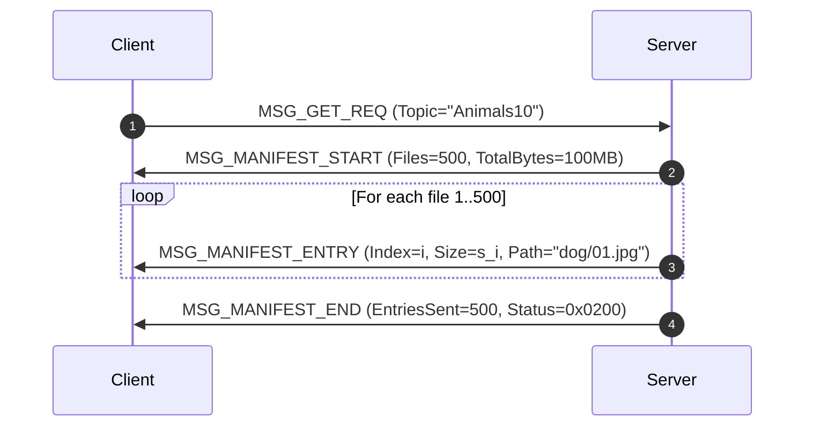

# IT305 Socket Programming Architecture Document
## Fault-Tolerant Topic-Based File Distribution System

**Document Status:** Approved Engineering Architecture (Refined)  
**Version:** 1.1.0  
**Target Architecture:** POSIX / C99 (Linux/UNIX Sockets & Pthreads)

---

## 1. High-Level Architecture Overview

The system consists of a **Topic-Based File Server** and a **File Distribution Client** communicating over standard TCP/IP sockets using a custom length-prefixed application protocol.



---

## 2. Server Concurrency & CLI Architecture

### 2.1 Concurrency Modes & CLI Specification
- **Mandatory Signature:** `./server <port> <topics_root_dir> [failure_probability]`
- **Default Mode:** Multi-Threaded (one pthread per client connection).
- **Mode Flag:** `./server <port> <topics_root_dir> [--mode single|multi]`
  - `single`: Process clients sequentially on the main thread.
  - `multi`: Main listener thread executes `accept()` and spawns detached worker threads (`pthread_create`).

```mermaid
graph LR
    subgraph Server Concurrency Architecture
        Listener[TCP Listener Port] -->|accept()| ModeSwitch{Mode Check}
        ModeSwitch -->|--mode single| SeqLoop[Sequential Client Handler]
        ModeSwitch -->|--mode multi / default| ThreadPool[Pthread Dispatcher]
        ThreadPool -->|Worker Thread| ClientHandler[Client Session Worker]
    end
```

### 2.2 Dynamic Session Table Architecture
To prevent arbitrary fixed array limitations, the server maintains a dynamic, thread-safe session table:

```c
typedef struct session_node {
    char session_id[33];
    char topic_name[64];
    uint32_t committed_file_index;
    uint64_t committed_byte_offset;
    uint64_t total_useful_bytes;
    time_t last_active_time;
    struct session_node *next;
} session_node_t;

typedef struct {
    session_node_t *buckets[256];
    uint32_t active_sessions_count;
    uint32_t max_allowed_sessions; // Default 4096, configurable
    pthread_mutex_t table_lock;
} session_table_t;
```

---

## 3. Case 2 Explicit Checkpoint Commitment Architecture

### 3.1 Checkpoint Commitment State Machine
The system relies on an **explicit commit model** to maintain state consistency across network failures:

1. **Client Payload Receive:** Client receives `MSG_DATA_CHUNK` from server.
2. **Local Persistence:** Client writes chunk payload to disk (`write()`).
3. **Local Checkpoint Update:** Client updates local state structure and writes to `.session_<topic>.chk`.
4. **Acknowledgement Transmission:** Client sends `MSG_ACK` payload `(Session_ID, File_Index, Acked_Byte_Offset)`.
5. **Server Commitment:** Server worker receives `MSG_ACK`, updates `session_table_t`, and marks the offset as *committed*.



### 3.2 Pre-ACK Failure & Redundant Byte Semantics
If a socket failure occurs after the client writes to disk but **before** the server processes `MSG_ACK`:
- Server's committed offset remains $O_{last\_ack}$ (e.g. 100 KB).
- Upon reconnection, server resumes streaming from $O_{last\_ack}$ (100 KB).
- Client receives data starting at 100 KB, seeks local file descriptor back to 100 KB (`lseek(fd, 100000, SEEK_SET)`), and overwrites the un-ACKed bytes (100 KB–164 KB).
- **Redundant Bytes Definition:** $B_{redundant}$ is defined strictly as payload bytes retransmitted *after* the last committed ACK offset due to un-ACKed interruptions.

---

## 4. Probabilistic Fault Injection Engine

- **Decision Location:** The Bernoulli failure check takes place on the server **immediately before** calling `write_n()` for each data chunk.
- **Thread Safety:** Each worker thread maintains an independent pseudo-random seed state (`rand_r(&thread_seed)` or `drand48_r()`).
- **Seed Parameter:** Configured via `./server ... [--seed S]`. Defaults to time-based seed if omitted.
- **Edge Behaviors:**
  - $p = 0.0$: Fault injector disabled; 0% connection interruptions.
  - $p = 1.0$: Connection drops on first data chunk attempt.
  - **Client Abort Guard:** Client enforces `--max-retries N` (default 10) to prevent infinite non-progressing reconnect loops when $p=1.0$.

---

## 5. Multi-Frame Manifest Architecture

For topic directories with large numbers of files, the server streams the manifest in bounded frames:



---

## 6. Checksum Architecture

1. **Local Checkpoint Protection (CRC32):** The client checkpoint file `.session_<topic>.chk` contains a CRC32 header checksum to detect local disk corruption of checkpoint records.
2. **File Integrity (SHA-256):** End-to-end payload verification is handled independently post-transfer by comparing source and downloaded directory SHA-256 hashes (`diff -r` or `sha256sum`).
