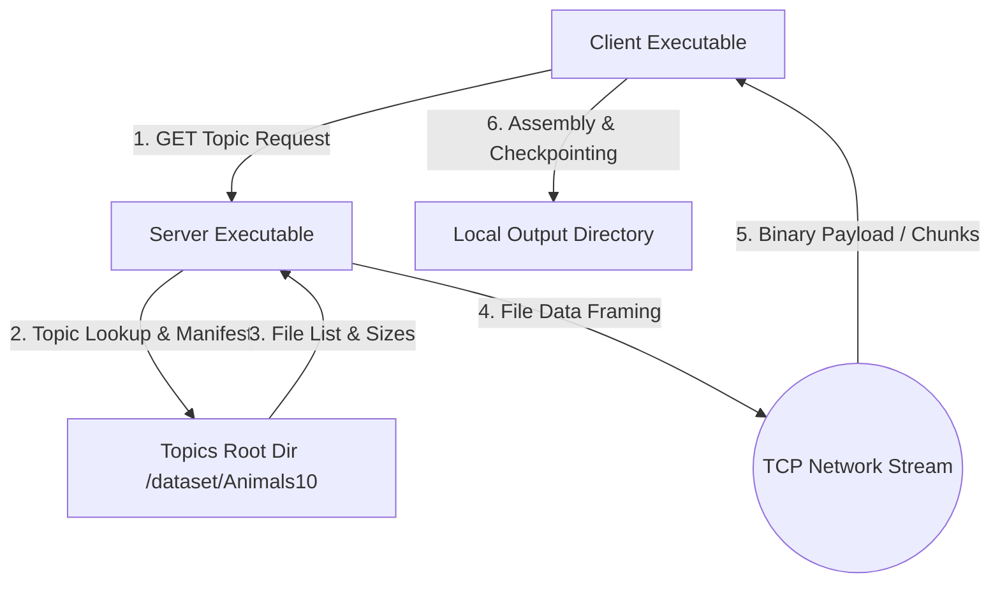
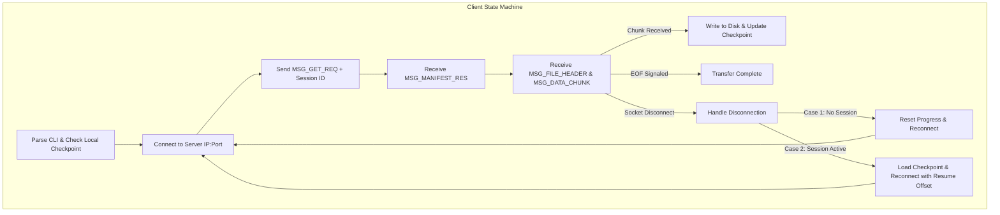
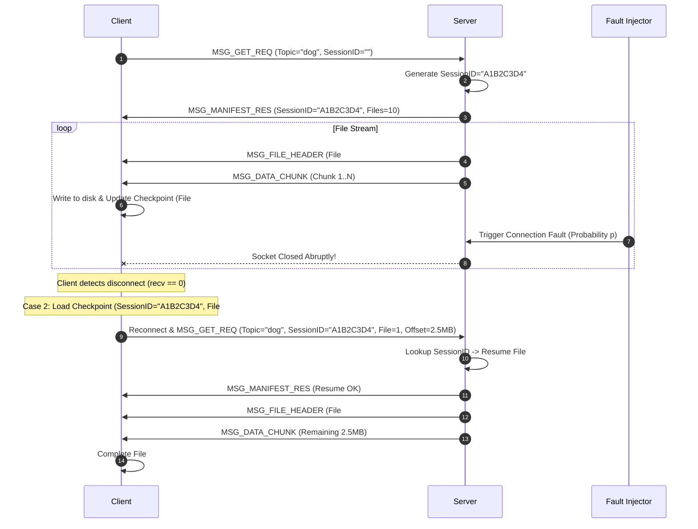

# IT305 Socket Programming Architecture Document
## Fault-Tolerant Topic-Based File Distribution System

**Document Status:** Approved Engineering Architecture  
**Version:** 1.0.0  
**Target Architecture:** POSIX / C99 (Linux/UNIX Sockets & Pthreads)

---

## 1. High-Level Architecture Overview

The system consists of a **Topic-Based File Server** and a **File Distribution Client** communicating over standard TCP/IP sockets using a custom length-prefixed application protocol.



---

## 2. Server Architecture

The server handles topic lookups, manifest construction, file streaming, session tracking, and probabilistic fault injection.

```mermaid
graph LR
    subgraph Server Runtime
        Listener[TCP Listener Port] -->|accept()| Dispatcher[Connection Handler / Thread Pool]
        Dispatcher -->|Worker Thread| SessionMgr[Session & Checkpoint Manager]
        Dispatcher -->|Worker Thread| TopicMapper[Topic Directory Resolver]
        Dispatcher -->|Worker Thread| FaultInjector[Probabilistic Fault Injector]
        FaultInjector -->|p < drand48()| ChunkStreamer[Chunked File Sender]
        FaultInjector -->|p >= drand48()| DropConn[Forceful Socket Close]
    end
```

### 2.1 Concurrency Models

#### 1. Single-Threaded Server Model (Part I)
- **Execution Loop:** Synchronous blocking event loop (`accept()` -> `handle_client()` -> `close()` -> repeat).
- **Behavior:** Serves one client connection to completion before calling `accept()` for the next queued connection. Incoming client connection requests backlog in the kernel socket listen queue (`listen(listen_fd, SOMAXCONN)`).

#### 2. Multi-Threaded Server Model (Part I & Part II)
- **Execution Loop:** Main listener thread executes blocking `accept()`.
- **Thread Delegation:** Upon new connection, main thread spawns a POSIX detached worker thread (`pthread_create` with `PTHREAD_CREATE_DETACHED`) passing the client socket file descriptor.
- **Concurrency Control:** Shared global session state and performance counters are protected by POSIX mutexes (`pthread_mutex_t`).

---

## 3. Client Architecture

The client requests topics, receives streamed metadata and file chunks, writes files to local disk, updates checkpoint state, and handles automatic reconnection upon socket drops.



---

## 4. Key Server & Client Data Structures

### 4.1 Topic Manifest Structure (`manifest_t`)
Represents the files belonging to a requested topic directory.

```c
typedef struct {
    char relative_path[256];
    uint64_t file_size;
} file_entry_t;

typedef struct {
    char topic_name[64];
    uint32_t total_files;
    uint64_t total_bytes;
    file_entry_t *files;
} manifest_t;
```

### 4.2 Server Session Record (`session_entry_t`)
Tracks client progress in memory on the server for Case 2 checkpointing.

```c
typedef struct {
    char session_id[33];         // 32-char hex string + null
    char topic_name[64];
    uint32_t current_file_index;
    uint64_t current_file_offset;
    uint64_t bytes_transferred;
    time_t last_active_time;
    int is_active;
} session_entry_t;

typedef struct {
    session_entry_t sessions[1024];
    pthread_mutex_t lock;
} session_table_t;
```

### 4.3 Client Checkpoint File Format (`.session_<topic>.chk`)
Stored locally on disk by the client for Case 2 state recovery.

```c
typedef struct {
    char session_id[33];
    char topic_name[64];
    uint32_t last_file_index;
    uint64_t last_byte_offset;
    uint64_t useful_bytes_received;
    uint32_t checksum_crc32;
} client_checkpoint_t;
```

---

## 5. Session Management & Checkpoint Strategy



---

## 6. Fault Injection Mechanism

1. **CLI Parameter:** Server parses float `failure_probability` $p \in [0.0, 1.0]$.
2. **Injection Point:** Inside the server chunk streaming loop (sending 64KB buffers):
   ```c
   float rand_val = (float)rand() / (float)RAND_MAX;
   if (rand_val < failure_prob) {
       log_warn("Fault injected! Force closing client fd %d", client_fd);
       shutdown(client_fd, SHUT_RDWR);
       close(client_fd);
       return NULL; // Terminate worker thread mid-transfer
   }
   ```
3. **Reproducibility:** A seed option (`--seed S`) can be passed for deterministic debugging during automated integration testing.

---

## 7. Case 2 Enhanced Architecture: Multi-Stream Non-Blocking Range Transfers

To improve performance over lossy socket environments:
- **Client Architecture:** Uses a non-blocking reactor multiplexing $K$ parallel TCP connection sockets (`epoll` / `select`).
- **Chunk Range Request Protocol:** Client requests byte ranges (e.g. Range 0–1MB on Stream 1, 1MB–2MB on Stream 2).
- **Fault Resiliency:** When a fault breaks Stream 1, only the un-ACKed range chunk of Stream 1 is re-queued, allowing remaining active streams to continue downloading uninterrupted.

---

## 8. Directory & Module Boundaries Architecture

To meet submission requirements while maintaining modular reuse, code is organized into a clean core module library (`src/common`, `src/server`, `src/client`), linked or compiled cleanly into each `Part/` subdirectory.

```
IT305-Socket-Programming/
├── docs/                      # Architectural & Protocol Specs
├── src/                       # Common Shared C Source Code
│   ├── common/                # Shared Protocol, Framing, Utilities
│   │   ├── protocol.h / .c    # Framing, Packet Structs, Serialization
│   │   ├── utils.h / .c       # Dynamic Paths, Timing, Logging
│   │   └── checksum.h / .c    # Checkpoint CRC32 verification
│   ├── server/                # Server Core Modules
│   │   ├── server_core.h / .c # Socket Listener, Thread Pool, Worker
│   │   ├── topic_mgr.h / .c   # Topic Directory Scanner & Manifest
│   │   ├── session_mgr.h / .c # Case 2 Session Table
│   │   └── fault_inject.h/.c # Probabilistic Fault Generator
│   └── client/                # Client Core Modules
│       ├── client_core.h / .c # Connection Loop, Disconnect Handler
│       ├── checkpoint.h / .c  # Local Checkpoint IO (.session.chk)
│       └── range_stream.h/.c # Enhanced Multi-Stream Manager
├── Part1/                     # Part I Standalone Executable Build
│   ├── server.c               # Invokes src/ build for Part 1
│   ├── client.c
│   └── Makefile
├── Part2_Case1/               # Part II Case 1 Standalone Build
│   ├── server.c
│   ├── client.c
│   └── Makefile
├── Part2_Case2/               # Part II Case 2 Standalone Build
│   ├── server.c
│   ├── client.c
│   └── Makefile
├── Part2_Case2_Enhanced/      # Part II Case 2 Enhanced Build
│   ├── server.c
│   ├── client.c
│   └── Makefile
├── tests/                     # Test Suites & Harness
└── scripts/                   # Automated Benchmark & Plotting Scripts
```
