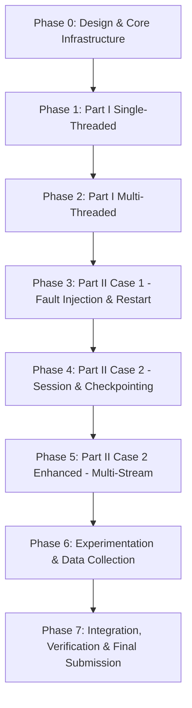

# IT305 Implementation Plan
## Fault-Tolerant Topic-Based File Distribution System

**Document Status:** Approved Master Implementation Roadmap  
**Version:** 1.0.0  
**Phases:** 8 Sequential Implementation & Verification Phases

---

## Phase Overview & Dependency Graph

---

## Phase 0: Repository & Engineering Foundation

- **Objective:** Establish common protocol headers, socket helpers, dynamic path handling, logging, build system, and design documentation.
- **Modules & Files:**
  - `docs/PROJECT_SPEC.md`, `docs/ARCHITECTURE.md`, `docs/PROTOCOL.md`, `docs/IMPLEMENTATION_PLAN.md`, `docs/TEST_PLAN.md`, `docs/EXPERIMENT_PLAN.md`, `docs/INTEGRATION_PLAN.md`
  - `AGENTS.md`
  - `src/common/protocol.h`, `src/common/protocol.c`
  - `src/common/utils.h`, `src/common/utils.c`
- **Dependencies:** None.
- **Acceptance Criteria:** Protocol structs compile cleanly under GCC (`-Wall -Wextra -std=c99`). Header serialization functions pass mock unit tests.

---

## Phase 1: Part I Single-Threaded Server & Client

- **Objective:** Implement sequential topic directory scanning, manifest creation, and synchronous single-client TCP file distribution.
- **Modules & Files:**
  - `src/server/topic_mgr.h / .c`
  - `Part1/server.c`
  - `Part1/client.c`
  - `Part1/Makefile`
- **Dependencies:** Phase 0 common protocol library.
- **Tests & Acceptance Criteria:**
  - `make` inside `Part1/` produces executables `./server` and `./client`.
  - Client command `./client 127.0.0.1 <port> <topic> <out_dir>` successfully downloads all files in `<topic>` folder.
  - Verification: `diff -r dataset/Animals10/<topic> <out_dir>/<topic>` returns zero differences.
  - Server handles Client A to completion before accepting Client B.

---

## Phase 2: Part I Multi-Threaded Server

- **Objective:** Extend server to handle multiple clients concurrently using pthreads.
- **Modules & Files:**
  - `src/server/server_core.h / .c`
  - Update `Part1/server.c` (supports CLI flag or mode for single vs multi-threaded).
- **Dependencies:** Phase 1 topic manager & framing core.
- **Tests & Acceptance Criteria:**
  - 10 concurrent client downloads run simultaneously without blocking or corrupting files.
  - No thread races or file descriptor leaks under `valgrind --leak-check=full`.

---

## Phase 3: Part II Case 1 — Fault Injection & Restart

- **Objective:** Introduce command-line failure probability $p$ and un-sessioned restart behavior.
- **Modules & Files:**
  - `src/server/fault_inject.h / .c`
  - `Part2_Case1/server.c`
  - `Part2_Case1/client.c`
  - `Part2_Case1/Makefile`
- **Dependencies:** Phase 2 multi-threaded server.
- **Tests & Acceptance Criteria:**
  - Server accepts `./server <port> <topics_root> <failure_prob>`.
  - With $p > 0$, active connections drop mid-transfer.
  - Client detects drop, reconnects, and restarts from File 0, Offset 0.
  - Total bytes transferred logged is strictly greater than useful bytes due to redundant retransmission.

---

## Phase 4: Part II Case 2 — Session & Checkpoint Management

- **Objective:** Implement server session state table and client disk checkpointing (`.session_<topic>.chk`) for zero-redundancy transfer resume.
- **Modules & Files:**
  - `src/server/session_mgr.h / .c`
  - `src/client/checkpoint.h / .c`
  - `Part2_Case2/server.c`
  - `Part2_Case2/client.c`
  - `Part2_Case2/Makefile`
- **Dependencies:** Phase 3 fault injection framework.
- **Tests & Acceptance Criteria:**
  - Server tracks active sessions in memory.
  - Upon reconnection after fault, client sends `Session ID` + resume offset.
  - Server resumes transfer strictly from saved byte offset.
  - Redundant payload bytes transferred is **0 bytes**.

---

## Phase 5: Case 2 Enhanced — Multi-Stream Parallel Transfer

- **Objective:** Implement non-blocking `epoll`/`select` range-streaming enhancement to boost throughput over lossy connections.
- **Modules & Files:**
  - `src/client/range_stream.h / .c`
  - `Part2_Case2_Enhanced/server.c`
  - `Part2_Case2_Enhanced/client.c`
  - `Part2_Case2_Enhanced/Makefile`
- **Dependencies:** Phase 4 Case 2 checkpoint architecture.
- **Tests & Acceptance Criteria:**
  - Client uses $K$ parallel TCP streams issuing byte range chunk requests.
  - Measured aggregate throughput under $p = 0.10$ exceeds standard Case 2 by $> 30\%$.

---

## Phase 6: Automated Experiment Harness & Benchmark Suite

- **Objective:** Build reproducible test harness scripts to automate multi-computer / multi-client benchmarks, generate CSVs, and plot graphs.
- **Modules & Files:**
  - `scripts/run_experiments.sh` or `scripts/benchmark.py`
  - `scripts/plot_results.py`
  - `Results/raw_data/*.csv`
  - `Results/plots/*.png`
- **Dependencies:** Phases 1–5 executables.
- **Tests & Acceptance Criteria:**
  - Automated script executes matrix of trials ($N \in \{1, 2, 4, 8, 16, 32\}$ clients; $p \in \{0.0, 0.05, 0.1, 0.2, 0.5\}$).
  - Generates publication-ready PNG graphs saved under `Results/plots/`.

---

## Phase 7: Final Integration, Code Cleanup & Final Report

- **Objective:** Verify submission directory layout, build cleanliness, zero compiler warnings, and generate the final project report PDF.
- **Modules & Files:**
  - `FinalSubmission_Group_<XXX>_<YYY>/` assembly directory.
  - `FinalReport_Group_<XXX>_<YYY>.pdf`
  - `README.md`
- **Dependencies:** All previous phases.
- **Acceptance Criteria:**
  - `make` inside `Part1/`, `Part2_Case1/`, `Part2_Case2/`, `Part2_Case2_Enhanced/` produces clean `server` and `client` binaries.
  - Project passes complete end-to-end automated verification suite.
