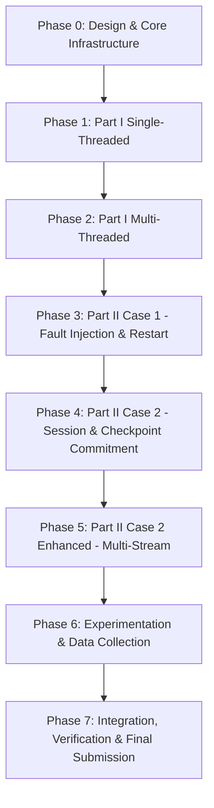

# IT305 Implementation Plan
## Fault-Tolerant Topic-Based File Distribution System

**Document Status:** Approved Master Implementation Roadmap (Final Refinement)  
**Version:** 1.2.0  
**Phases:** 8 Sequential Implementation & Verification Phases

---

## Phase Overview & Dependency Graph

---

## Phase 0: Core Infrastructure & Protocol Library

- **Objective:** Implement 12-byte header serialization, sequence number management, explicit `uint64_t` payload offset serialization, multi-frame manifest structures with $MAX\_PATH\_LEN = 4096$ validation, socket helper routines (`read_n`, `write_n`), and CRC32 checkpoint validation.
- **Modules & Files:**
  - `docs/*`, `AGENTS.md`
  - `src/common/protocol.h`, `src/common/protocol.c`
  - `src/common/utils.h`, `src/common/utils.c`
  - `src/common/checksum.h`, `src/common/checksum.c`
- **Acceptance Criteria:** Header serialization functions pass unit tests. Multi-frame manifest functions encode/decode correctly and reject paths $> 4096$ bytes with `0x0400 ERR_PATH_TOO_LONG`. Zero compiler warnings under GCC `-Wall -Wextra -Werror -pedantic`.

---

## Phase 1: Part I Single-Threaded Server & Client

- **Objective:** Implement sequential topic directory scanning, multi-frame manifest streaming, and synchronous single-client TCP file distribution.
- **Modules & Files:**
  - `src/server/topic_mgr.h / .c`
  - `Part1/server.c`
  - `Part1/client.c`
  - `Part1/Makefile`
- **Acceptance Criteria:**
  - `./server <port> <topics_root> --mode single` handles clients sequentially.
  - Client command `./client <server_ip> <port> <topic> <out_dir>` successfully downloads topic files.
  - `diff -r dataset/Animals10/<topic> <out_dir>/<topic>` returns zero differences.

---

## Phase 2: Part I Multi-Threaded Server

- **Objective:** Implement concurrent multi-threaded server handling using detached pthreads (`pthread_create`).
- **Modules & Files:**
  - `src/server/server_core.h / .c`
  - Update `Part1/server.c` (defaults to multi-threaded execution).
- **Acceptance Criteria:**
  - 10 concurrent clients execute transfers simultaneously without blocking or corrupted files.
  - Passes Valgrind memory leak audit without unclosed sockets or leaks.

---

## Phase 3: Part II Case 1 — Fault Injection & Full Restart

- **Objective:** Introduce command-line failure probability $p \in [0.0, 1.0]$, per-chunk Bernoulli fault generator, seed support `--seed`, and un-sessioned restart behavior.
- **Modules & Files:**
  - `src/server/fault_inject.h / .c`
  - `Part2_Case1/server.c`
  - `Part2_Case1/client.c`
  - `Part2_Case1/Makefile`
- **Acceptance Criteria:**
  - Server executes `./server <port> <topics_root> <failure_prob> [--seed S]`.
  - With $p > 0$, connections drop mid-transfer; client reconnects from File 0, Offset 0.
  - Total wire bytes recorded strictly exceeds useful bytes due to redundant retransmissions.

---

## Phase 4: Part II Case 2 — Session Management & Checkpoint Commitment

- **Objective:** Implement dynamic server session table, client checkpoint disk persistence (`.session_<topic>.chk`), explicit `MSG_ACK` commitment loop, and checkpoint-based minimized redundancy.
- **Modules & Files:**
  - `src/server/session_mgr.h / .c`
  - `src/client/checkpoint.h / .c`
  - `Part2_Case2/server.c`
  - `Part2_Case2/client.c`
  - `Part2_Case2/Makefile`
- **Acceptance Criteria:**
  - A byte is committed ONLY after client receives, writes to disk, updates checkpoint, sends `MSG_ACK`, and server processes ACK.
  - Retransmitted file payload bytes after un-ACKed failures are counted as $B_{redundant}$.
  - Bytes BEFORE last committed ACK offset are NEVER retransmitted.

---

## Phase 5: Case 2 Enhanced — Multi-Stream Parallel Transfer

- **Objective:** Implement non-blocking `epoll`/`select` parallel range-streaming client architecture to evaluate performance over lossy connections.
- **Modules & Files:**
  - `src/client/range_stream.h / .c`
  - `Part2_Case2_Enhanced/server.c`
  - `Part2_Case2_Enhanced/client.c`
  - `Part2_Case2_Enhanced/Makefile`
- **Acceptance Criteria:**
  - Client spawns $K$ parallel TCP connections issuing disjoint ranged chunk requests.
  - Atomic range queue prevents overlapping assignments; failed stream ranges are returned to queue.
  - Range maps track completion; checkpoint commits contiguous completed offsets across streams.
  - Empirically measures completion time, throughput, and overhead, logging metrics for report comparison against standard Case 2.

---

## Phase 6: Automated Experiment Harness & Benchmark Suite

- **Objective:** Build reproducible test harness scripts to automate multi-computer benchmarks, export CSVs, and generate performance graphs.
- **Modules & Files:**
  - `scripts/run_experiments.sh`
  - `scripts/plot_results.py`
  - `Results/raw_data/*.csv`
  - `Results/plots/*.png`
- **Acceptance Criteria:**
  - Automated script executes benchmark matrix ($N \in \{1..32\}$ clients, $p \in \{0.0..0.5\}$).
  - Produces publication-ready PNG graphs saved under `Results/plots/`.

---

## Phase 7: Final Integration, Code Cleanup & Final Report

- **Objective:** Assemble submission directory layout, verify build cleanliness across all parts, and finalize project report PDF.
- **Modules & Files:**
  - `FinalSubmission_Group_<XXX>_<YYY>/` assembly directory.
  - `FinalReport_Group_<XXX>_<YYY>.pdf`
  - `README.md`
- **Acceptance Criteria:**
  - `make` inside `Part1/`, `Part2_Case1/`, `Part2_Case2/`, `Part2_Case2_Enhanced/` produces clean `server` and `client` binaries.
  - Clean end-to-end automated verification across all test cases.
