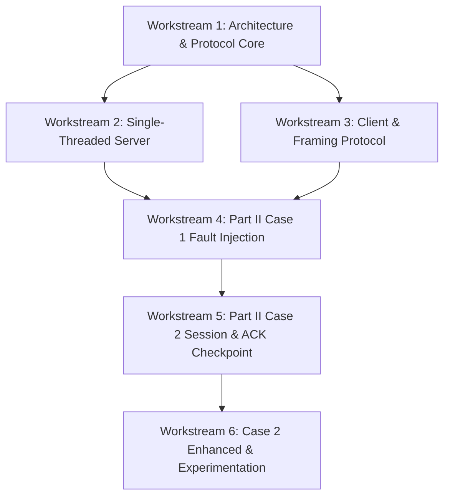

# IT305 Six-Workstream Integration Plan
## Parallel Development Strategy & Collaborative Engineering Framework

**Document Status:** Approved Integration Strategy (Refined)  
**Version:** 1.1.0  
**Team Structure:** 6 Logical Workstreams

---

## 1. Six-Workstream Organization & Ownership

To maximize parallel development speed without causing code collision, the project is structured into six clean workstreams.



### Workstream Responsibilities Matrix

| Workstream | Primary Role & Responsibility | Core Deliverables / Files Owned |
| :--- | :--- | :--- |
| **Workstream 1** | System Architect & Protocol Lead | `src/common/protocol.h/.c`, `src/common/checksum.h/.c`, `docs/*`, `AGENTS.md` |
| **Workstream 2** | Part I Server Concurrency Engineer | `src/server/topic_mgr.h/.c`, `src/server/server_core.h/.c`, `Part1/server.c` |
| **Workstream 3** | Part I Client & Manifest Framing Engineer | `src/client/client_core.h/.c`, `Part1/client.c` |
| **Workstream 4** | Part II Case 1 Fault Injection Engineer | `src/server/fault_inject.h/.c`, `Part2_Case1/server.c`, `Part2_Case1/client.c` |
| **Workstream 5** | Part II Case 2 Session & ACK Specialist | `src/server/session_mgr.h/.c`, `src/client/checkpoint.h/.c`, `Part2_Case2/*` |
| **Workstream 6** | Enhanced Streaming & Benchmarking Specialist | `src/client/range_stream.h/.c`, `Part2_Case2_Enhanced/*`, `scripts/*`, `Results/*` |

---

## 2. Shared Core Architecture & Header Contracts

All six workstreams rely on common interfaces defined by Workstream 1:

- `src/common/protocol.h`: Defines packet types (`MSG_MANIFEST_START`, `MSG_MANIFEST_ENTRY`, `MSG_MANIFEST_END`, `MSG_ACK`), 12-byte binary header with 32-bit sequence number, bit flags, error codes, `read_n()`, `write_n()`.
- `src/common/checksum.h`: Lightweight CRC32 checkpoint validation functions.
- `src/common/utils.h`: Dynamic path formatting, monotonic timing helpers, synchronized logging.
- `src/server/session_mgr.h`: Thread-safe dynamic session hash table and explicit `MSG_ACK` commitment functions.

---

## 3. Branching & Git Integration Strategy

- **Protected Main Branch:** `main` branch remains stable and buildable.
- **Feature Branches:**
  - `feature/ws1-protocol-core`
  - `feature/ws2-server-concurrency`
  - `feature/ws3-client-manifest`
  - `feature/ws4-fault-injection-case1`
  - `feature/ws5-session-ack-checkpoint-case2`
  - `feature/ws6-enhanced-streaming-benchmarks`

---

## 4. Submission Directory Modular Reusability Design

Each submission directory (`Part1/`, `Part2_Case1/`, `Part2_Case2/`, `Part2_Case2_Enhanced/`) compiles binaries linked against shared core modules from `src/`.

```makefile
# Example Part1/Makefile using modular src/ linkage
CC = gcc
CFLAGS = -Wall -Wextra -Werror -std=c99 -I../src/common -I../src/server -I../src/client -D_POSIX_C_SOURCE=200809L
LDFLAGS = -pthread

COMMON_SRCS = ../src/common/protocol.c ../src/common/utils.c ../src/common/checksum.c
SERVER_SRCS = server.c ../src/server/topic_mgr.c ../src/server/server_core.c $(COMMON_SRCS)
CLIENT_SRCS = client.c ../src/client/client_core.c $(COMMON_SRCS)

all: server client

server: $(SERVER_SRCS)
	$(CC) $(CFLAGS) -o $@ $^ $(LDFLAGS)

client: $(CLIENT_SRCS)
	$(CC) $(CFLAGS) -o $@ $^ $(LDFLAGS)

clean:
	rm -f server client *.o
```
