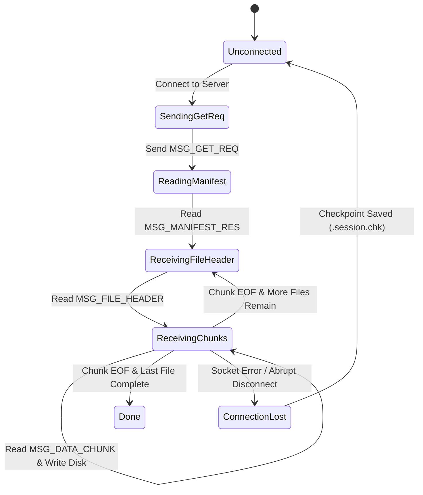

# IT305 Wire Protocol Specification
## Application Layer Framing Protocol for Topic-Based File Transfer

**Document Status:** Approved Wire Protocol Standard  
**Version:** 1.0.0  
**Byte Order:** Network Byte Order (Big-Endian) for numeric headers

---

## 1. Overview & TCP Byte-Stream Framing Rules

TCP is a stream-oriented protocol without inherent message boundaries. A single call to `send()` by the server may be split across multiple `recv()` calls on the client, or multiple small `send()` calls may be coalesced into a single TCP segment.

To prevent framing ambiguity, buffer corruption, and protocol desynchronization:
1. **Fixed Header:** Every protocol message begins with a fixed **12-byte Application Header**.
2. **Explicit Length Prefix:** The header explicitly specifies the 32-bit payload length following the header.
3. **Strict Reader Loop (`read_n`):** Receivers MUST loop over `recv()` until exactly 12 bytes of header are read before decoding payload length $L$, and then loop until all $L$ bytes of payload are consumed.

---

## 2. Fixed Header Layout (12 Bytes)

```
 0                   1                   2                   3
 0 1 2 3 4 5 6 7 8 9 0 1 2 3 4 5 6 7 8 9 0 1 2 3 4 5 6 7 8 9 0 1
+-+-+-+-+-+-+-+-+-+-+-+-+-+-+-+-+-+-+-+-+-+-+-+-+-+-+-+-+-+-+-+-+
|          Magic Bytes          |  Msg Type (1B)|   Flags (1B)  |
|         0x49 0x54 ('IT')      |               |               |
+-+-+-+-+-+-+-+-+-+-+-+-+-+-+-+-+-+-+-+-+-+-+-+-+-+-+-+-+-+-+-+-+
|                        Payload Length (4B)                    |
+-+-+-+-+-+-+-+-+-+-+-+-+-+-+-+-+-+-+-+-+-+-+-+-+-+-+-+-+-+-+-+-+
|                      Sequence / Offset (4B)                   |
+-+-+-+-+-+-+-+-+-+-+-+-+-+-+-+-+-+-+-+-+-+-+-+-+-+-+-+-+-+-+-+-+
```

### Header Fields Detail

| Field Offset | Field Name | Type | Size | Description |
| :--- | :--- | :--- | :--- | :--- |
| **0x00** | `magic_bytes` | uint16_t | 2 Bytes | Protocol identifier. Constant `0x4954` ('I', 'T'). Packets without magic are rejected immediately. |
| **0x02** | `msg_type` | uint8_t | 1 Byte | Identifies message type (`enum MsgType`). |
| **0x03** | `flags` | uint8_t | 1 Byte | Bit flags: `0x01` = RESUME_REQ, `0x02` = EOF_FILE, `0x04` = FINAL_TOPIC_DONE, `0x08` = ERR_FLAG. |
| **0x04** | `payload_len` | uint32_t | 4 Bytes | Length of following binary payload payload in bytes (0 to 65536). Big-Endian (`htonl`). |
| **0x08** | `seq_or_offset` | uint32_t | 4 Bytes | Chunk sequence number or low 32-bit block index for data packets. |

---

## 3. Protocol Message Types (`enum MsgType`)

| Code | Symbol | Direction | Purpose |
| :--- | :--- | :--- | :--- |
| **0x01** | `MSG_GET_REQ` | Client -> Server | Request topic transfer (initial or resume). |
| **0x02** | `MSG_MANIFEST_RES` | Server -> Client | Respond with session ID, total file count, total bytes. |
| **0x03** | `MSG_FILE_HEADER` | Server -> Client | Signal start of a specific file in the topic. |
| **0x04** | `MSG_DATA_CHUNK` | Server -> Client | Stream raw file payload data chunk. |
| **0x05** | `MSG_ACK` | Client -> Server | Periodic byte offset receipt acknowledgement. |
| **0x06** | `MSG_TRANSFER_DONE` | Server -> Client | Signal end of entire topic transfer. |
| **0x07** | `MSG_ERROR` | Server -> Client | Report error (topic not found, invalid offset, etc.). |
| **0x08** | `MSG_RANGE_REQ` | Client -> Server | Enhanced mode range request (Part II Enhanced). |

---

## 4. Detailed Message Definitions

### 4.1 `MSG_GET_REQ` (0x01) — Client Topic Request

- **Direction:** Client $\rightarrow$ Server
- **Flags:** `0x00` (New Request) or `0x01` (Resume Request)
- **Payload Structure:**
  ```
  +-----------------------------------+-----------------------------------+
  | Topic Name (Null-Term, 64 Bytes)  | Session ID (Null-Term, 33 Bytes)  |
  +-----------------------------------+-----------------------------------+
  | Resume File Index (uint32, 4B)    | Resume Byte Offset (uint64, 8B)   |
  +-----------------------------------+-----------------------------------+
  ```
- **Meaning:** Client requests files under `<topics_root_dir>/<Topic>`. If `Session ID` is non-empty and `RESUME` flag is set, server attempts session recovery from specified file index and byte offset.
- **Expected Response:** `MSG_MANIFEST_RES` on success, `MSG_ERROR` on failure.

---

### 4.2 `MSG_MANIFEST_RES` (0x02) — Topic Manifest Response

- **Direction:** Server $\rightarrow$ Client
- **Payload Structure:**
  ```
  +-----------------------------------+-----------------------------------+
  | Status Code (uint16, 2B)          | Session ID (Null-Term, 33 Bytes)  |
  +-----------------------------------+-----------------------------------+
  | Total Files Count (uint32, 4B)    | Aggregate Topic Bytes (uint64, 8B)|
  +-----------------------------------+-----------------------------------+
  | Repeated File Entries:                                                |
  |   - File Index (uint32, 4B)                                           |
  |   - File Size (uint64, 8B)                                            |
  |   - Path String Length (uint16, 2B)                                   |
  |   - Relative Path String (Var-len)                                    |
  +-----------------------------------------------------------------------+
  ```
- **Meaning:** Informs client of assigned `Session ID`, total file count, and list of files. Client uses this manifest to pre-allocate local directory structures.

---

### 4.3 `MSG_FILE_HEADER` (0x03) — File Start Indicator

- **Direction:** Server $\rightarrow$ Client
- **Payload Structure:**
  ```
  +-----------------------------------+-----------------------------------+
  | File Index (uint32, 4B)           | File Start Offset (uint64, 8B)    |
  +-----------------------------------+-----------------------------------+
  | Total File Size (uint64, 8B)      | Relative Path (Null-Term, Var)    |
  +-----------------------------------+-----------------------------------+
  ```
- **Meaning:** Sent prior to streaming a file's data chunks. Informs client of the file being sent and the initial offset (0 for new file, $>0$ for resumed file).

---

### 4.4 `MSG_DATA_CHUNK` (0x04) — Data Streaming

- **Direction:** Server $\rightarrow$ Client
- **Flags:** `0x02` set if this is the final chunk of the current file (`FLAG_EOF_FILE`).
- **Payload:** Raw binary byte buffer (up to 64 KB per chunk).
- **Meaning:** Carries content of the active file. Client writes payload directly to local disk at `current_file_offset`.

---

### 4.5 `MSG_TRANSFER_DONE` (0x06) — Topic Transfer Complete

- **Direction:** Server $\rightarrow$ Client
- **Flags:** `0x04` (`FLAG_FINAL_TOPIC_DONE`)
- **Payload Structure:**
  ```
  +-----------------------------------+-----------------------------------+
  | Session ID (Null-Term, 33 Bytes)  | Total Payload Bytes Sent (uint64) |
  +-----------------------------------+-----------------------------------+
  ```
- **Meaning:** Signals that all files in the topic have been fully transmitted. Client deletes local `.session_<topic>.chk` checkpoint file and exits cleanly.

---

### 4.6 `MSG_ERROR` (0x07) — Error Signaling

- **Direction:** Server $\rightarrow$ Client
- **Payload Structure:**
  ```
  +-----------------------------------+-----------------------------------+
  | Error Code (uint16, 2B)           | Error Message (Null-Term String)  |
  +-----------------------------------+-----------------------------------+
  ```
- **Error Codes:**
  - `0x0404`: Topic directory not found.
  - `0x0400`: Malformed request header / invalid protocol magic.
  - `0x0409`: Invalid Session ID / expired session state.
  - `0x0500`: Internal server filesystem read error.

---

## 5. Session Checkpointing & Framing State Machine



---

## 6. Case 1 vs. Case 2 Message Flows on Fault Interruption

### Case 1 (No Session Management)
1. Connection drops during File 2, Byte 500,000.
2. Client detects `recv()` return value $\le 0$.
3. Client reconnects and sends `MSG_GET_REQ` with `Session ID = ""` and `Resume Offset = 0`.
4. Server starts transfer from **File 0, Byte 0**.
5. Client overwrites previously downloaded bytes (redundant retransmission).

### Case 2 (Session Management & Checkpointing)
1. Connection drops during File 2, Byte 500,000.
2. Client updates `.session_<topic>.chk` with `Session ID = "S123"`, `File Index = 2`, `Byte Offset = 500000`.
3. Client reconnects and sends `MSG_GET_REQ` with `Session ID = "S123"`, `Resume File Index = 2`, `Resume Byte Offset = 500000`, `Flags = RESUME`.
4. Server validates `S123` in session table, opens File 2, performs `lseek(fd, 500000, SEEK_SET)`.
5. Server sends `MSG_FILE_HEADER` (StartOffset = 500,000) followed by remaining data chunks.
6. Client seeks local file descriptor to 500,000 and appends incoming chunks. Zero redundant payload bytes transmitted.
