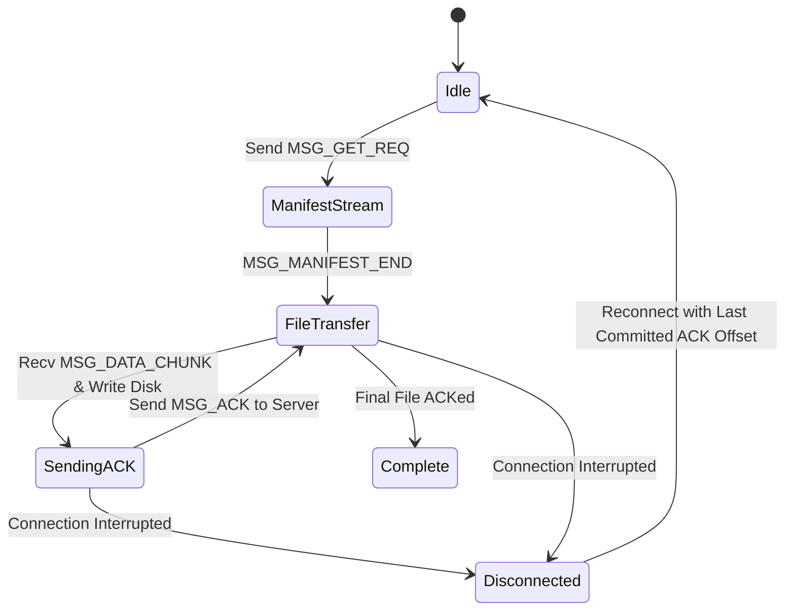

# IT305 Wire Protocol Specification
## Application Layer Framing Protocol for Topic-Based File Transfer

**Document Status:** Approved Wire Protocol Standard (Refined)  
**Version:** 1.1.0  
**Byte Order:** Network Byte Order (Big-Endian) for all numeric binary fields

---

## 1. TCP Byte-Stream Framing Rules

TCP provides a continuous byte stream without application-level frame boundaries. To prevent message boundary ambiguity, buffer corruption, and framing desynchronization:
1. **Fixed Header:** Every message begins with a mandatory **12-byte Application Header**.
2. **32-Bit Sequence Number:** The header contains an explicit 32-bit packet sequence number (`seq_num`).
3. **Payload Length Prefix:** The header specifies payload length $L$ (0 to 65,536 bytes).
4. **Payload Offsets:** All 64-bit file byte offsets (`uint64_t`) are explicitly serialized inside packet payloads.
5. **Strict Reader Loop (`read_n`):** Receivers MUST loop over `recv()` until exactly 12 bytes of header are read before decoding payload length $L$, and then loop until all $L$ bytes of payload are consumed.

---

## 2. Fixed Header Layout (12 Bytes)

```
 0                   1                   2                   3
 0 1 2 3 4 5 6 7 8 9 0 1 2 3 4 5 6 7 8 9 0 1 2 3 4 5 6 7 8 9 0 1
+-+-+-+-+-+-+-+-+-+-+-+-+-+-+-+-+-+-+-+-+-+-+-+-+-+-+-+-+-+-+-+-+
|          Magic Bytes          |  Msg Type (1B)|   Flags (1B)  |
|         0x49 0x54 ('IT')      |               |               |
+-+-+-+-+-+-+-+-+-+-+-+-+-+-+-+-+-+-+-+-+-+-+-+-+-+-+-+-+-+-+-+-+
|                        Payload Length (4B)                    |
+-+-+-+-+-+-+-+-+-+-+-+-+-+-+-+-+-+-+-+-+-+-+-+-+-+-+-+-+-+-+-+-+
|                     Sequence Number (4B)                      |
+-+-+-+-+-+-+-+-+-+-+-+-+-+-+-+-+-+-+-+-+-+-+-+-+-+-+-+-+-+-+-+-+
```

### Header Fields Detail

| Field Offset | Field Name | Type | Size | Description |
| :--- | :--- | :--- | :--- | :--- |
| **0x00** | `magic_bytes` | uint16_t | 2 Bytes | Constant `0x4954` ('I', 'T'). Invalid magic results in immediate disconnect. |
| **0x02** | `msg_type` | uint8_t | 1 Byte | Message identifier (`enum MsgType`). |
| **0x03** | `flags` | uint8_t | 1 Byte | Bit flags: `0x01` = FLAG_RESUME, `0x02` = FLAG_EOF_FILE, `0x04` = FLAG_FINAL_DONE, `0x08` = FLAG_ERR. |
| **0x04** | `payload_len` | uint32_t | 4 Bytes | Payload length in bytes (0 to 65,536). Big-Endian (`htonl`). |
| **0x08** | `seq_num` | uint32_t | 4 Bytes | Monotonically increasing packet sequence number per session. |

---

## 3. Protocol Message Types (`enum MsgType`)

| Code | Symbol | Direction | Purpose |
| :--- | :--- | :--- | :--- |
| **0x01** | `MSG_GET_REQ` | Client -> Server | Request topic file transfer (new or resume). |
| **0x02** | `MSG_MANIFEST_START` | Server -> Client | Begin manifest streaming (session ID, totals). |
| **0x03** | `MSG_FILE_HEADER` | Server -> Client | Signal start of file in topic. |
| **0x04** | `MSG_DATA_CHUNK` | Server -> Client | Stream raw file payload chunk. |
| **0x05** | `MSG_ACK` | Client -> Server | Explicit checkpoint acknowledgement. |
| **0x06** | `MSG_TRANSFER_DONE` | Server -> Client | Signal completion of entire topic transfer. |
| **0x07** | `MSG_ERROR` | Server -> Client | Report error state. |
| **0x08** | `MSG_RANGE_REQ` | Client -> Server | Enhanced mode parallel stream range request. |
| **0x09** | `MSG_MANIFEST_ENTRY` | Server -> Client | Stream single file metadata entry in manifest. |
| **0x0A** | `MSG_MANIFEST_END` | Server -> Client | Signal completion of manifest streaming. |

---

## 4. Message Definitions & Payload Schemas

### 4.1 `MSG_GET_REQ` (0x01) — Client Topic Request
- **Direction:** Client $\rightarrow$ Server
- **Payload Layout:**
  ```
  +-----------------------------------+-----------------------------------+
  | Topic Name (Null-Term, 64 Bytes)  | Session ID (Null-Term, 33 Bytes)  |
  +-----------------------------------+-----------------------------------+
  | Resume File Index (uint32_t, 4B)  | Resume Byte Offset (uint64_t, 8B) |
  +-----------------------------------+-----------------------------------+
  ```
- **Semantics:** If `FLAG_RESUME` is set and `Session ID` is valid, server resumes from `(Resume File Index, Resume Byte Offset)`.

---

### 4.2 Multi-Frame Manifest Sequence (0x02, 0x09, 0x0A)
To handle directories with arbitrary numbers of files without exceeding `payload_len <= 65536`:

#### `MSG_MANIFEST_START` (0x02)
- **Payload Layout:**
  ```
  +-----------------------------------+-----------------------------------+
  | Status Code (uint16_t, 2B)        | Session ID (Null-Term, 33 Bytes)  |
  +-----------------------------------+-----------------------------------+
  | Total Files (uint32_t, 4B)        | Total Topic Bytes (uint64_t, 8B)  |
  +-----------------------------------+-----------------------------------+
  ```

#### `MSG_MANIFEST_ENTRY` (0x09) — Repeated per file
- **Payload Layout:**
  ```
  +-----------------------------------+-----------------------------------+
  | File Index (uint32_t, 4B)         | File Size (uint64_t, 8B)          |
  +-----------------------------------+-----------------------------------+
  | Path String Length (uint16_t, 2B) | Relative Path String (Var-len)    |
  +-----------------------------------+-----------------------------------+
  ```

#### `MSG_MANIFEST_END` (0x0A)
- **Payload Layout:**
  ```
  +-----------------------------------+-----------------------------------+
  | Total Entries Sent (uint32_t, 4B) | Final Manifest Status (uint16, 2B)|
  +-----------------------------------+-----------------------------------+
  ```

---

### 4.3 `MSG_FILE_HEADER` (0x03) — File Start Indicator
- **Payload Layout:**
  ```
  +-----------------------------------+-----------------------------------+
  | File Index (uint32_t, 4B)         | Start Byte Offset (uint64_t, 8B)  |
  +-----------------------------------+-----------------------------------+
  | Total File Size (uint64_t, 8B)    | Relative Path (Null-Term String)  |
  +-----------------------------------+-----------------------------------+
  ```

---

### 4.4 `MSG_DATA_CHUNK` (0x04) — Data Streaming
- **Flags:** `0x02` (`FLAG_EOF_FILE`) set on final chunk of active file.
- **Payload:** Raw binary file bytes (up to 64 KB per frame).

---

### 4.5 `MSG_ACK` (0x05) — Explicit Checkpoint Commitment ACK
- **Direction:** Client $\rightarrow$ Server
- **Payload Layout:**
  ```
  +-----------------------------------+-----------------------------------+
  | Session ID (Null-Term, 33 Bytes)  | File Index (uint32_t, 4B)         |
  +-----------------------------------+-----------------------------------+
  | Acked Byte Offset (uint64_t, 8B)  | CRC32 Checkpoint Checksum (4B)   |
  +-----------------------------------+-----------------------------------+
  ```
- **Semantics:** Client sends this packet ONLY AFTER writing chunk data to disk and updating local checkpoint. Server updates its session record upon receipt. Duplicate ACKs are idempotent.

---

### 4.6 `MSG_TRANSFER_DONE` (0x06) & `MSG_ERROR` (0x07)
- `MSG_TRANSFER_DONE` carries `Session ID` (33B) and `Total Payload Bytes Sent` (uint64_t).
- `MSG_ERROR` carries `Error Code` (uint16_t) and `Error Message` string (`0x0404`: Topic Not Found, `0x0400`: Bad Magic, `0x0503`: Session Table Full).

---

## 5. Protocol State Machine & Failure Scenarios



### Explicit Scenarios & Edge Cases
1. **Failure Before ACK:** Client writes to disk but socket closes before `MSG_ACK` reaches server. Server session retains previous committed offset $O_{committed}$. Client reconnects with request at $O_{committed}$. Server resumes at $O_{committed}$; client overwrites un-ACKed local trailing bytes.
2. **Duplicate ACK:** Server receives duplicate `MSG_ACK` due to network reordering. Server treats operation as idempotent and updates timestamp.
3. **File Boundary Resume:** When file $k$ completes, client sends `MSG_ACK` with `File Index = k` and `Acked Offset = FileSize_k`. Resume resumes at `File Index = k+1`, `Offset = 0`.
4. **Final Chunk Resume:** If failure occurs on final chunk before ACK commit, resume requests start offset of final chunk.
